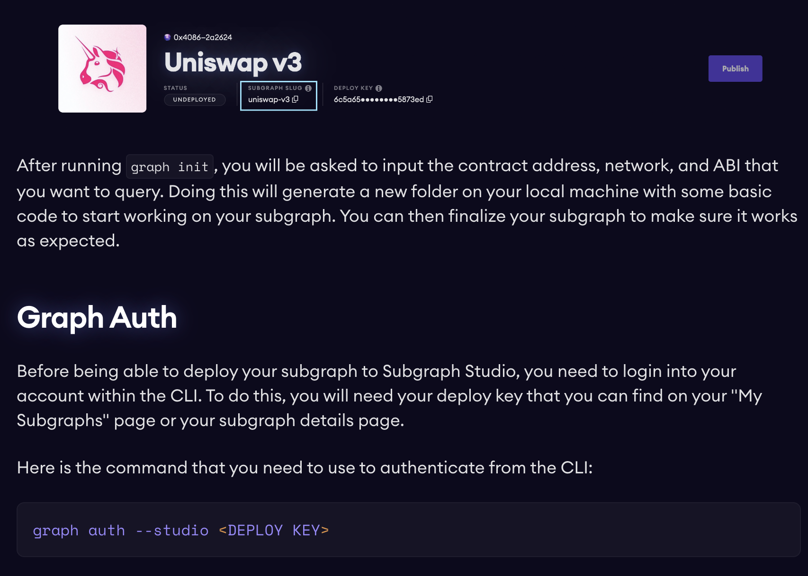
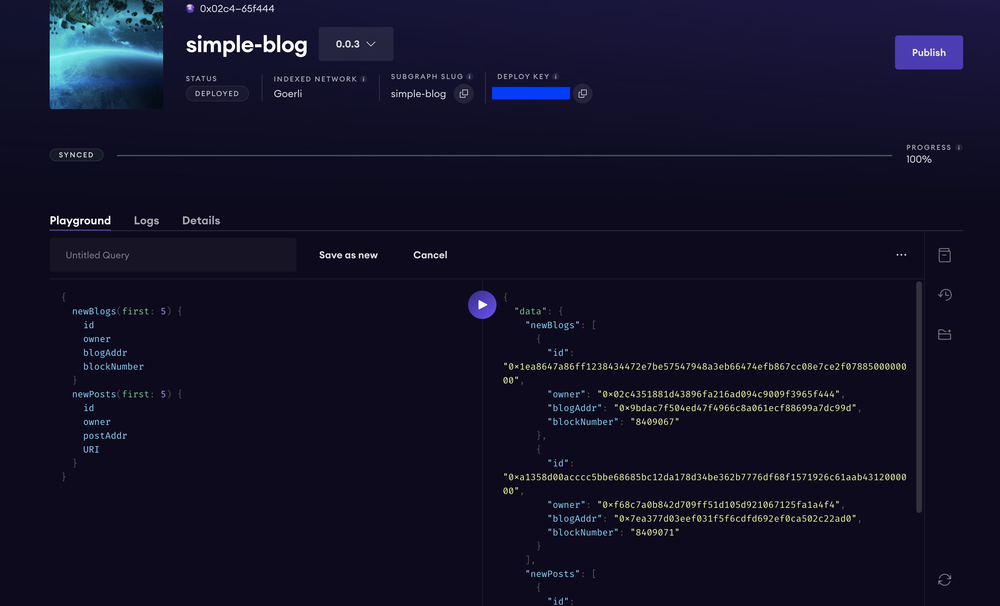

# The Graph simple blog example
This repository serves as an Subgraph example of how to interact with the Goerli testnet and access to the events generated by the my-simple-blog repository.

To better understand this example please watch: 
* [solidity-simple-blog repository](https://github.com/kchain-solutions/solidity-simple-blog)
* [Creating a subgraph tutorial](https://thegraph.com/docs/en/developing/creating-a-subgraph/)
* [AssemblyScript API](https://thegraph.com/docs/en/developing/assemblyscript-api/)

The events that the Subgraph will index are
* ```event NewBlog(address owner, address blogAddr);```
* ```event NewPost(address owner, address post, string URI);```

# How to run the code

## Install graph-cli
```npm install -g @graphprotocol/graph-cli```

## Login into your graph-cli account
Access with your metamask account to the [The Graph Studio](https://thegraph.com/studio/) and login with your api key into the graph-cli.



## Deploy code
Clone this repository, enter in the project directory with the terminal and run: 
* ```npm run codegen```
* ```npm run deploy```

At the end of the deployment you will be redirected to the page where to perform GraphQL queries.



# Understand the code

## subgraph.yaml
a YAML file containing the subgraph manifest. 
This file holds all necessary configurations for compiling the code. It includes information about the smart contract to monitor, the reference network, the starting block for recording events, and the relationships between the ABI file, events, and event handlers.

```yaml
dataSources:
  - kind: ethereum
    name: BlogFactory
    network: goerli
    source:
      address: "0x2259Ff8FfEF4e92454a4ef1ED516291c5A2CC3fC"
      abi: BlogFactory
      startBlock: 8409000
    mapping:
      kind: ethereum/events
      apiVersion: 0.0.7
      language: wasm/assemblyscript
      entities:
        - NewBlog
      abis:
        - name: BlogFactory
          file: ./abis/BlogFactory.json
      eventHandlers:
        - event: NewBlog(address,address)
          handler: handleNewBlog
      file: ./src/blog-factory.ts
```

```yaml
templates:
  - kind: ethereum
    name: Blog
    network: goerli
    source:
      abi: Blog
    mapping:
      kind: ethereum/events
      apiVersion: 0.0.7
      language: wasm/assemblyscript
      entities:
        - NewPost
      abis:
        - name: Blog
          file: ./abis/Blog.json
      eventHandlers:
        - event: NewPost(address,address,string)
          handler: handleNewPost
      file: ./src/blog-factory.ts
```
It is important to note the distinction between a **dataSource** and a **template**. The template does not include any references to a smart contract because, in this particular scenario, the Blog addresses are dynamically generated through the BlogFactory.

The Blog address, to be listened to, will be created at runtime and can be seen from the line of code:

```typescript
Blog.create(event.params.blogAddr);
```

In the file ```blog-factory.ts```

## abis folder
The abis folder contains all the abi of the contract to index. This is required to map event into the manifest file.


## schema.graphql
The GraphQL schema defines what data is stored for your subgraph, and how to query it via GraphQL.
Required fields are represented by an exclamation point

## ./src/blog-factory.ts
The file contains all the application logic and translates an event into the schema that can be queried via GraphQL.

## network.json
Contains the list of networks and the addresses of the associated contracts.
